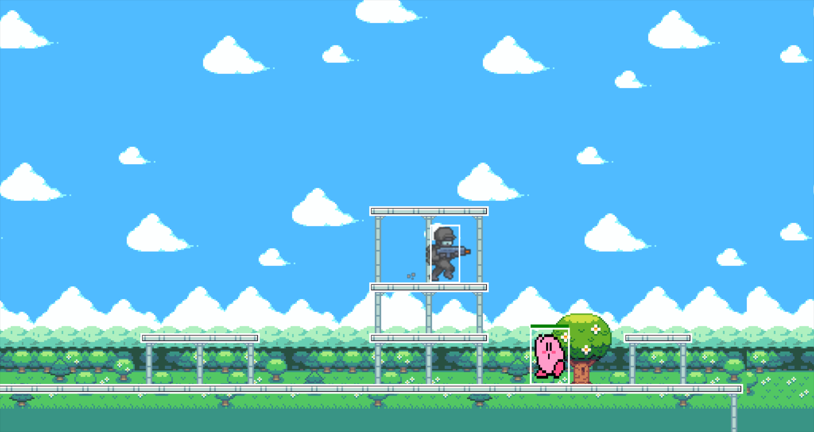
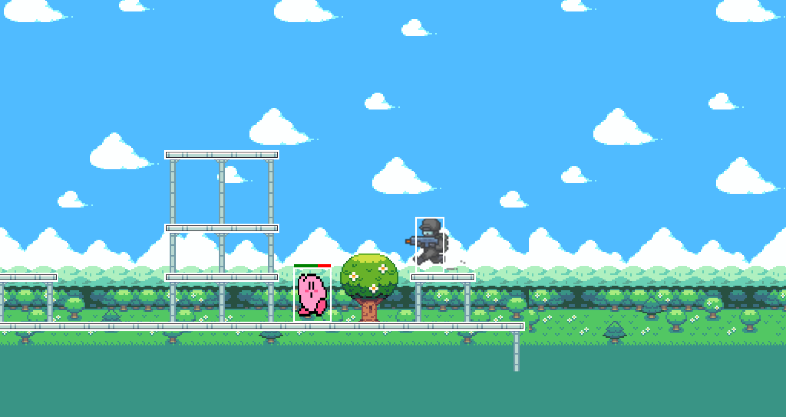
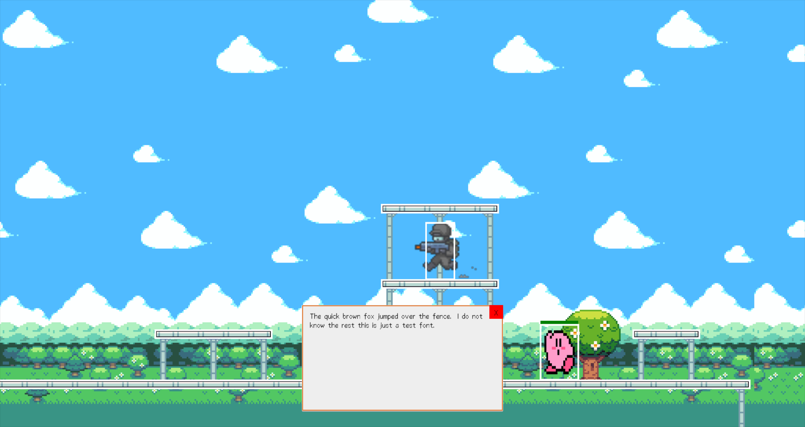

# LOVE2D Platformer

Simple 2D Platformer made using Lua in LOVE2D.

## Usage
Zip the contents and rename the zipped folder's extension to ```.love```.  Make sure you have <a href='https://love2d.org/'>LOVE</a> Installed.

## In Game Screenshots
### Player and enemy kirby (both with colliders around them)


### Kirby after being damaged by the player


### UI Text popup example


## Wrappers Used
<ul>
  <li><a href='https://github.com/rxi/classic'>classic</a></li>

  <li><a href='https://github.com/karai17/Simple-Tiled-Implementation'>simple tiled implementation</a></li>

  <li><a href='https://github.com/vrld/hump/blob/master/camera.lua'>hump.camera</a></li>
</ul>
